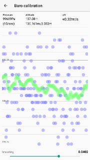
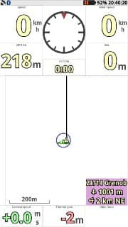
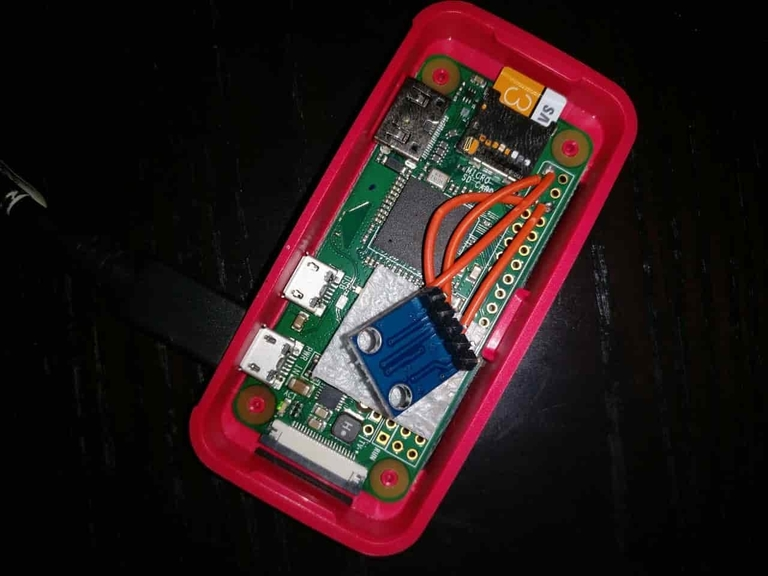
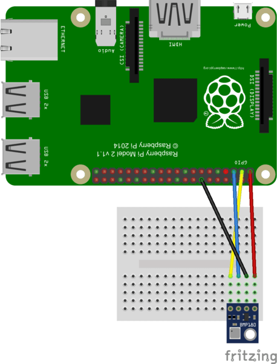

# Pivario [](https://travis-ci.org/eliecharra/pivario)





Pivario is a simple BLE peripheral reading a BMP(085|180) pressure sensor as sending proper NMEA sentences (LK8EX1).

Compatibles apps :

- XCTracker
- Flyme
- Maybe other untested app which support LK8EX1 sentences

Compatibles Devices (tested)

- Raspberry pi 3
- Raspberry pi 0 W

This should work on any arm device with a proper bluetooth interface.

## Hardware

Required :
- Raspberyr pi 0 W or compatible device (see above)
- BMP180 sensor (BPM085 will work too)



## Software

You need to build docker image on your device as this is an arm build.

```
git clone https://github.com/eliecharra/pivario.git && cd pivario
```

Identify your current platform and edit `Dockerfile.template` to use proper base image ([more info](https://www.balena.io/docs/reference/base-images/base-images/))

- Raspberry pi 0 W : `FROM resin/raspberry-pi-node:8-slim`
- Raspberry pi 3 : `FROM resin/raspberrypi3-node:8-slim`

You will find a list of availaible arch from the link above

```
docker-compose build
docker-compose run
```

Then your device should start advertising on BLE and you could connect to it.
